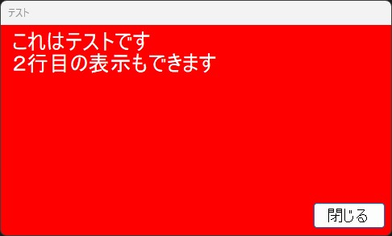

# メッセージウィンドウの表示

## 使い方
コマンドプロンプトで引数処理を行うことにより、メッセージウィンドウを表示させることができる。

コマンドは、
> MessageForm.exe "ウィンドウフォームの名称" "表示したいメッセージ"

とする。表示するメッセージを開業したい場合は、改行コードの`\r\n`を入力する。

また、オプションの入力も可能。

* /fs：フォントサイズ
* /fc：フォントカラー（デフォルト：Black）
* /bc：背景カラー
* /fw：幅（デフォルト：450）
* /fh：高さ（デフォルト：250）

例えば、
> MessageForm.exe テスト これはテストです\r\n２行目の表示もでき ます /fs 20 /fc White /bc Red

とすると、下記のようなウィンドウが表示される。  
